# FortVault

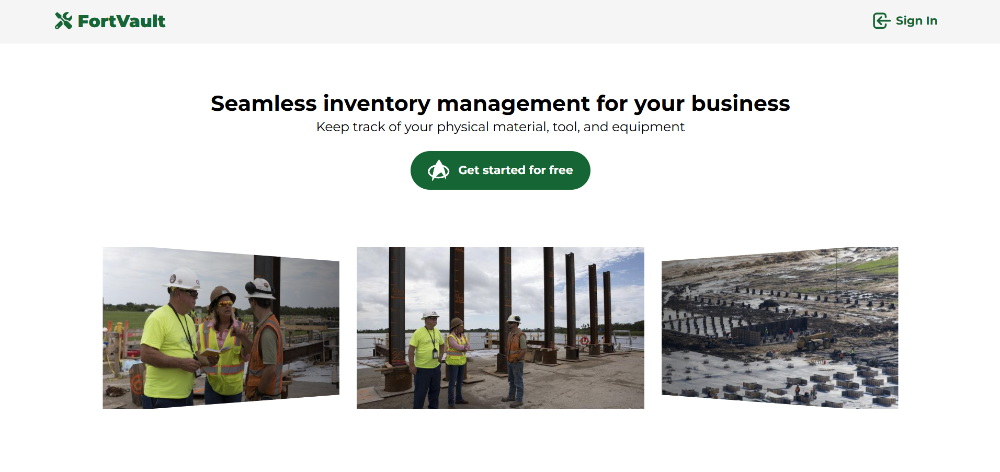

## Background Info

**FortVault** is a platform designed to help field workers manage their inventory conveniently. The application provides essential function, such as inventory creation, inventory loan, and worker management. The application is built using the PostgreSQL, Flask, React TypeScript stack.

The link to the backend repository can be found here: [FortVault Server](https://github.com/KevinPramudyanto/fortvault-server)

## Table of Contents

- [Screenshots](#screenshots)
- [Features](#features)
- [Technologies Used](#technologies-used)
- [ERD & Planning Materials](#erd--planning-materials)
- [Getting Started](#getting-started)
- [Running The Application](#running-the-application)
- [Folder Structure](#folder-structure)
- [Future Enhancements](#future-enhancements)
- [Attributions](#attributions)

## Screenshots

### Signup Page

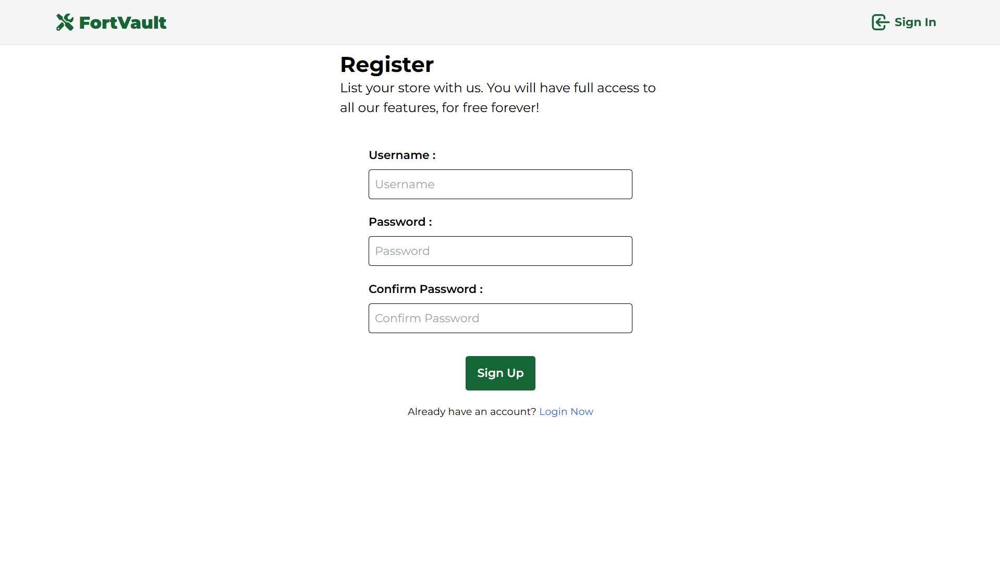
User can create their account, as a store manager.

### Signin Page

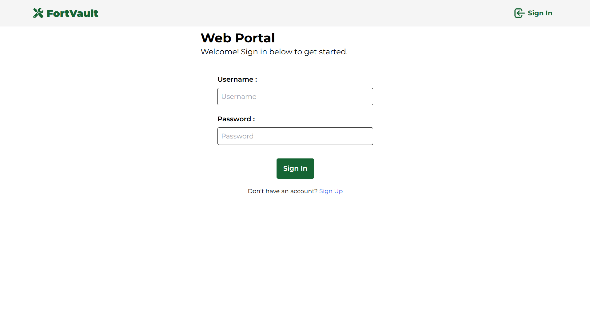
User can login to their account. Store manager will be able to manage the inventory and workers. Worker will be able to view and borrow the inventory.

### Inventory Page

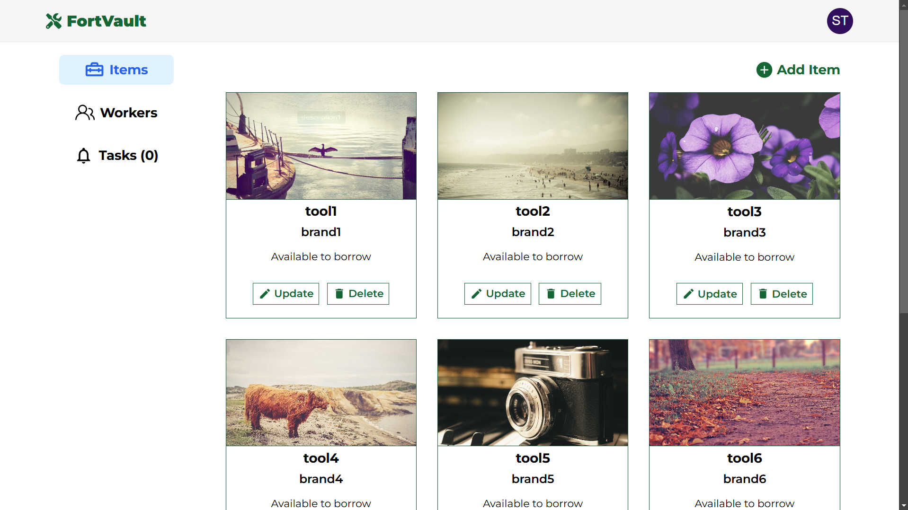
Both manager and worker will be able to view the inventory.

### Manage Inventory Page

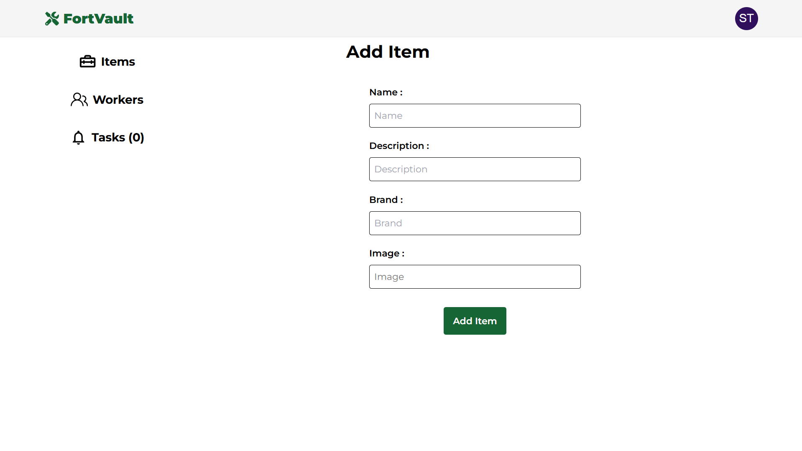
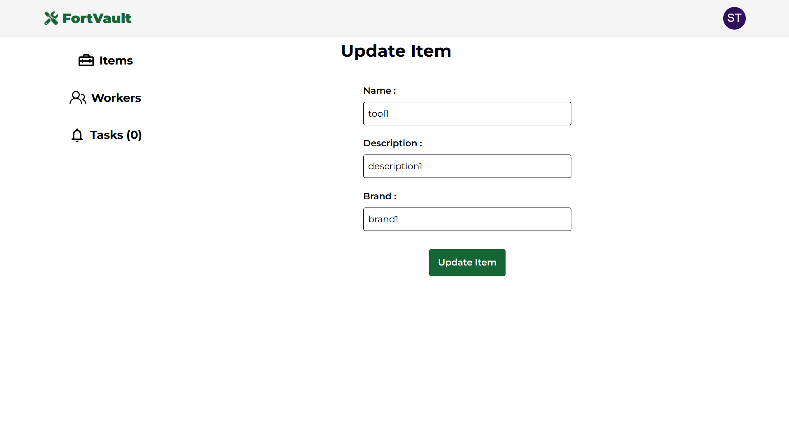
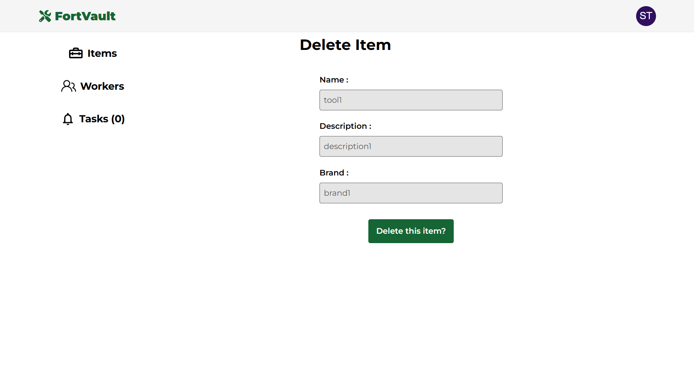
Manager will be able to create, update, and delete the inventory.

### Borrow Inventory Page

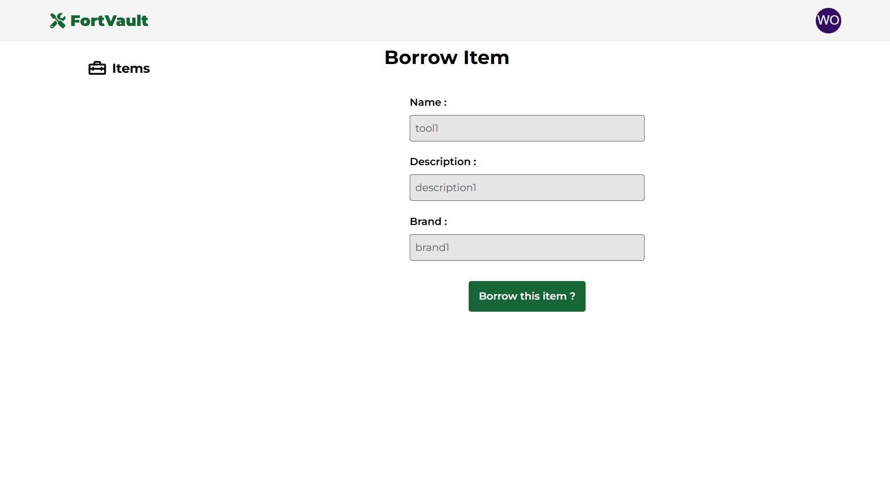
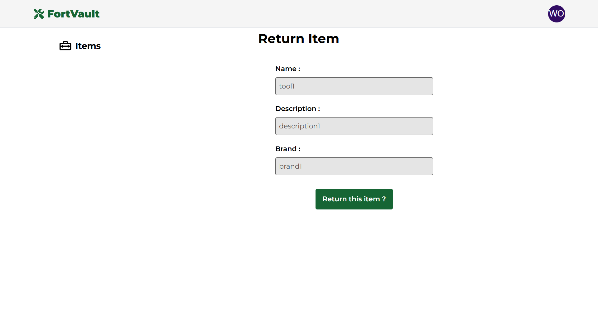
Worker will be able to borrow and return the inventory.

### Approve Inventory Page

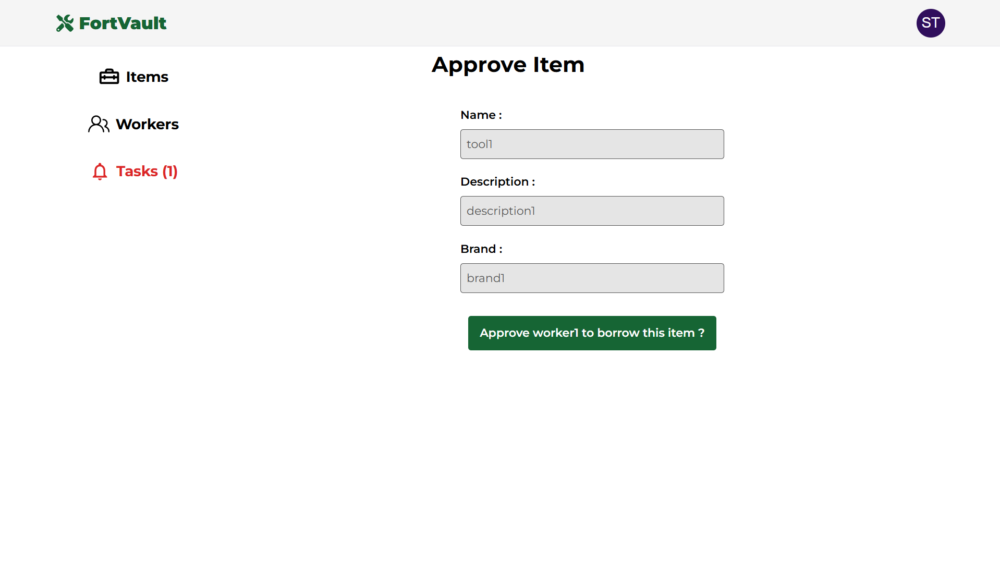
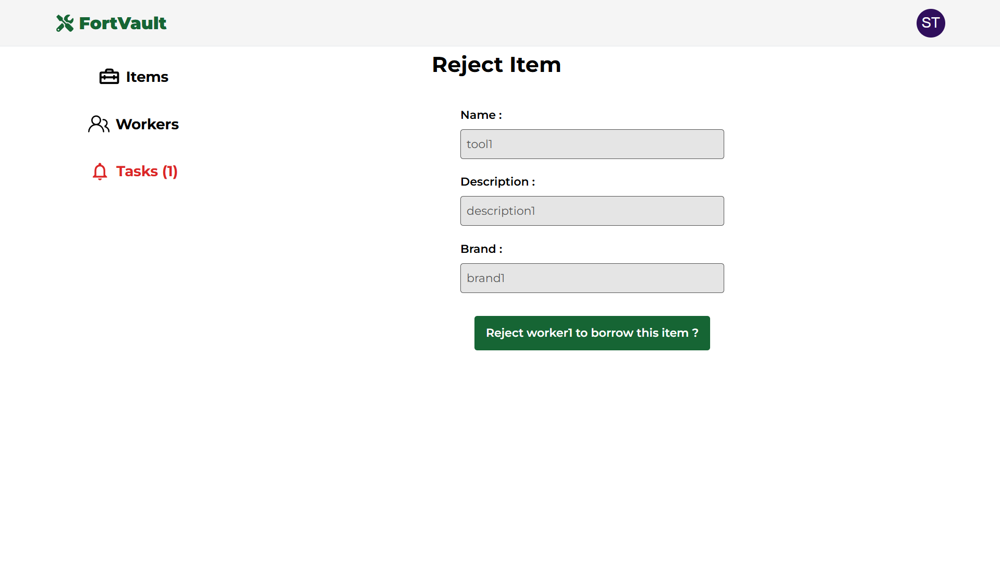
Manager will be able to either approve or reject the inventory.

### Manage Worker Page

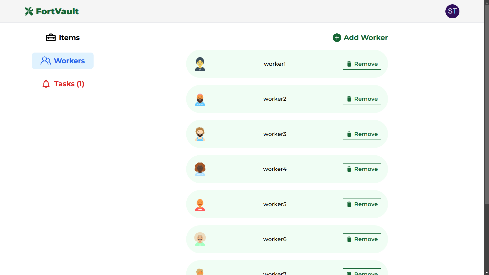
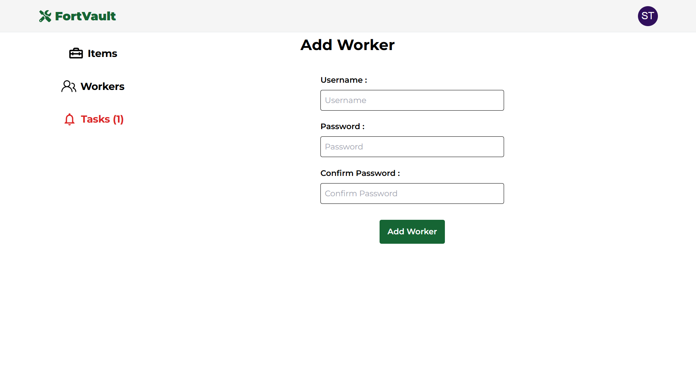
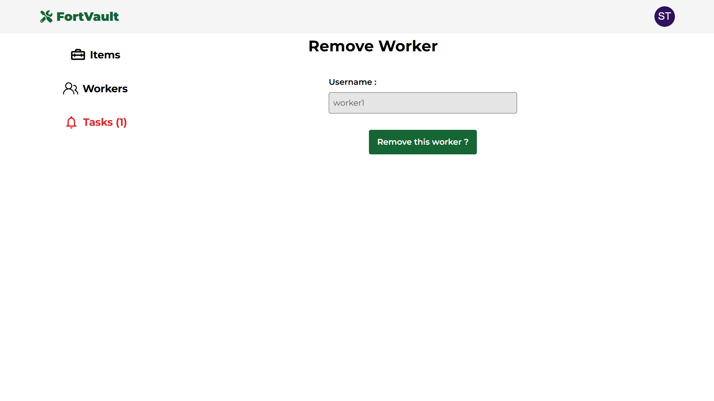
Manager will be able to create account for their new worker, view the list of workers, or delete account of their worker.

### Notification Page

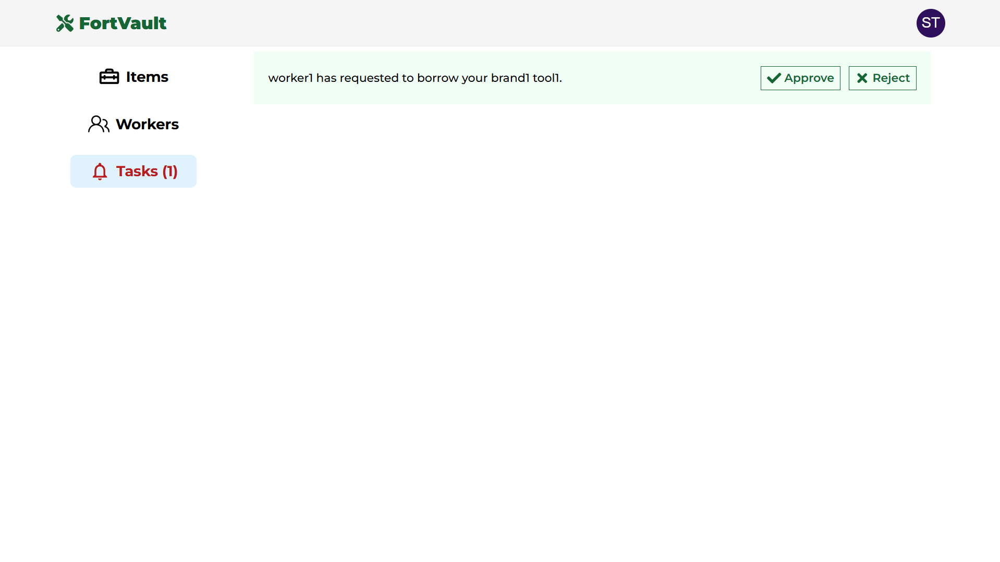
Manager will be able to view if any pending tasks.

### Change Password Page

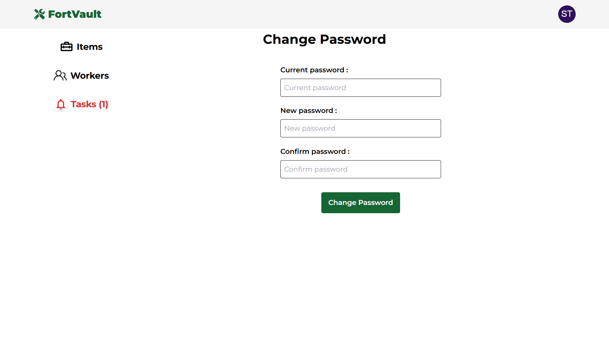
Users can change their password.

### Statistics Page

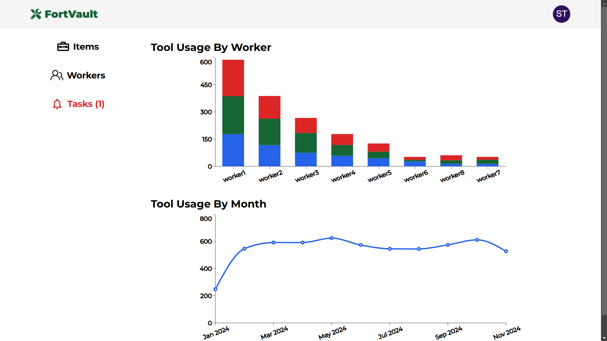
Displays information about their tools and their workers.

## Features

- **Landing Page**: Brief overview of the app and its functionality to attract potential new users.
- **Inventory Details**: View and manage each of your inventory.
- **Profile Management**: Manage account settings, such as change password
- **Responsive Design**: Enjoy a seamless experience across all devices, from smartphones to desktops.

## Technologies Used

### Frontend

- **React TypeScript**: Front-end JavaScript library for building user interfaces.
- **Vite**: Development environment and bundler.
- **React Router**: Declarative routing for React applications.
- **TanStack Query**: For efficient data fetching, caching and state management.
- **Axios**: Promise-based HTTP client for API requests.
- **Tailwind CSS**: Utility-first CSS framework for styling.

### Backend

- **Flask**: Web application framework written in Python.
- **PostgreSQL**: SQL database for data storage.
- **psycopg2-binary**: PostgreSQL database adapter for Python.
- **flask-jwt-extended** - Library for creating and verifying JSON Web Tokens (JWTs) for authentication.

## ERD & Planning Materials

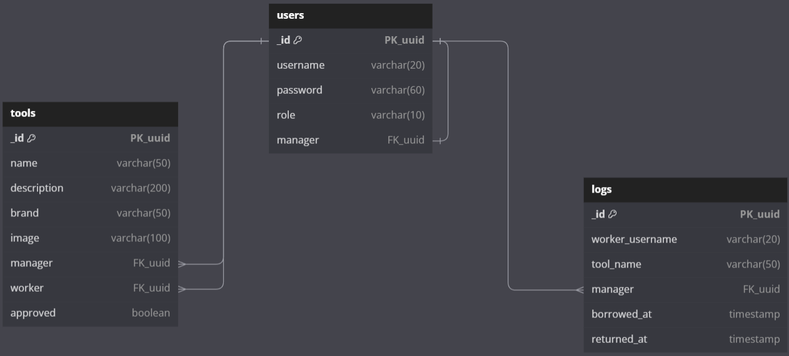

The `tools` table references the `users` table, and the `logs` table references the `users` table.

User Stories and Stretch Goals : [Trello board](https://trello.com/b/Ch66DBxd/fortvault)

## Getting Started

To get started with the project, follow these steps:

### Prerequisites

1. Ensure [PostgreSQL](https://www.postgresql.org/download/) is installed.

2. Create Cloudinary by signing up [here](https://cloudinary.com/)

### To Run Locally

#### Frontend (fortvault)

1. Open terminal and clone the repository:

   ```bash
   git clone https://github.com/KevinPramudyanto/fortvault.git
   ```

2. Navigate to the project directory:

   ```bash
   cd fortvault
   ```

3. Install the client dependencies:

   ```bash
   npm i
   ```

4. Create a `.env` file in the project directory and add the following variable:

   ```
   VITE_SERVER_URL=http://localhost:5001
   VITE_CLOUDNAME=<your-cloudinary-cloudname>
   ```

   with `<your-cloudinary-cloudname>` is your cloudinary cloudname

#### Backend (fortvault-server)

1. In another directory, open terminal and clone the repository:

   ```bash
   git clone https://github.com/KevinPramudyanto/fortvault-server.git
   ```

2. Navigate to the project directory:

   ```bash
   cd fortvault-server
   ```

3. Install the server dependencies:

   ```bash
   pipenv install
   ```

4. Create environment variables in Run/Debug Configurations and add the following row:

   ```
   CLOUD_NAME=<your-cloudinary-cloudname>;
   DB=<your-db-name>;
   DB_HOST=localhost;
   DB_PASSWORD=<your-db-password>;
   DB_PORT=5432;
   DB_USER=<your-db-username>;
   JWT_SECRET_KEY=<your-secret-key>;
   UPLOAD_PRESET=<your-cloudinary-upload-preset>
   ```

## Running The Application

### Start the server

Run `main.py` within the `fortvault-server` directory.

### Start the client

Run `npm run dev` within the `fortvault` directory.

## Folder Structure

The project structure is organized as follows:

#### Frontend (fortvault)

```
fortvault/
├── src/
│   ├── api/            # API call logic using axios
│   ├── components/     # React components
│   ├── context/        # React context providers for state management
│   ├── pages/          # Page-level components for different routes
├── .env                # Environment variables (not tracked in version control)
├── package.json        # Dependencies and scripts for the client
```

#### Backend (fortvault-server)

```
fortvault-server/
├── resources/         # Request handling logic and API route definitions
├── db/                # Database connection and setup
├── Pipfile            # Dependencies and scripts for the server
```

## Future Enhancements

1. **Send Email for Forgot Password**: Enable users to reset password by sending to their email.
2. **Push Notification for New Task**: Users will receive real-time notification for new pending approval.
3. **Chat between Manager and Worker**: Allow users to start a real-time chat with their manager or worker.

## Attributions

### Resources

- Montserrat font from [Google Fonts](https://fonts.google.com/specimen/Montserrat).
- Components from [Material UI](https://mui.com/material-ui/all-components/).
- Icons from [React Icons](https://react-icons.github.io/react-icons/).
- Title bar icon 1 from [Flaticon](https://www.flaticon.com/free-icon/safe_2489669)
- Title bar icon 2 from [Flaticon](https://www.flaticon.com/free-icon/check_5610944)

### References

- [Tailwind CSS Documentation](https://tailwindcss.com/docs)
- [TanStack Query Documentation](https://tanstack.com/query/latest/docs/framework/react/overview)
- [React Router Documentation](https://reactrouter.com/)
- [Swiper](https://swiperjs.com/react)
- [Recharts](https://recharts.org/en-US/)
